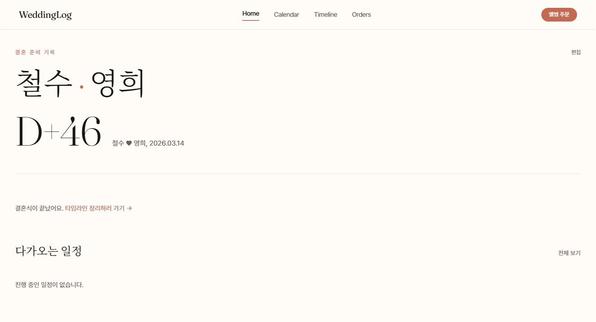
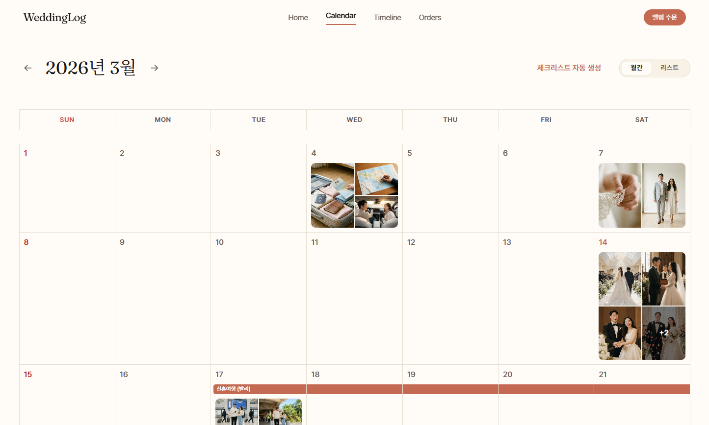
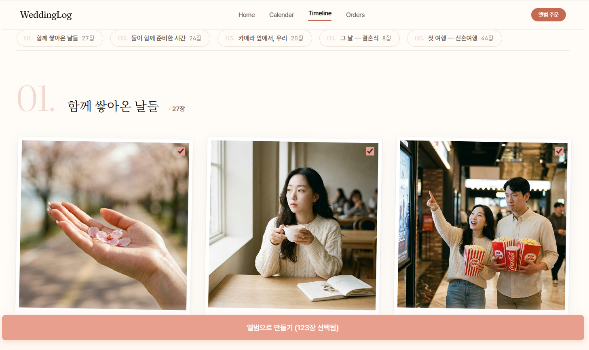
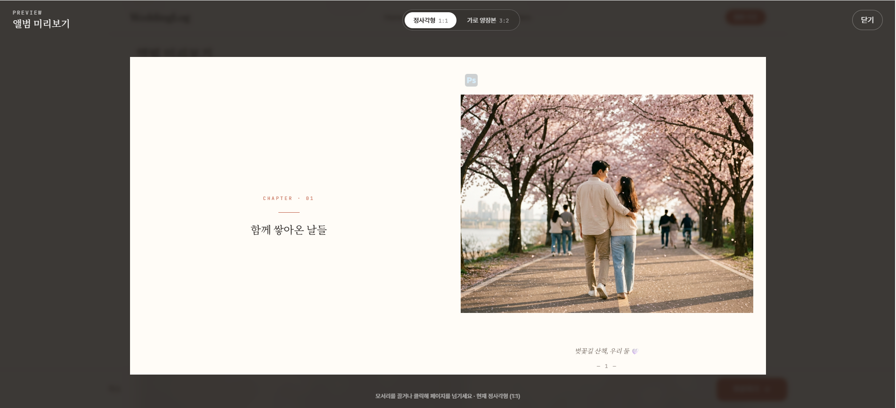
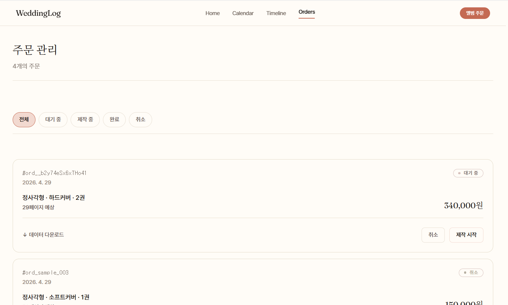
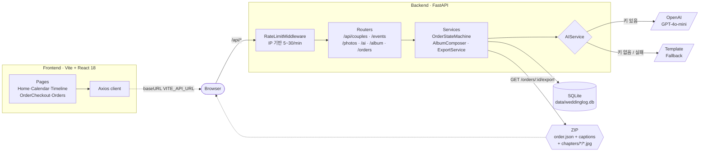

# WeddingLog

> 결혼 준비 과정의 일정·사진·축하 메시지를 한 권의 책으로 묶어주는 서비스.

[]() []() []()

> **개발자** [@baesisi3648](https://github.com/baesisi3648) · **기간** 2026-04-23 ~ 2026-04-29 (7일) · **커밋** 73+ · **메인 도구** Claude Code (Opus 4.7) + Google Stitch MCP

---

## 📖 1. 서비스 소개

WeddingLog 는 사용자가 **6개월 ~ 1년에 걸친 결혼 준비 과정**을 가볍게 기록하면, 마지막에 그 기록이 **한 권의 양장본 앨범** 으로 변환되는 서비스입니다. 단순한 SNS 사진첩이 아니라, **준비 과정 자체가 콘텐츠** 가 되는 흐름을 지향합니다.

### 타겟 사용자

- 결혼식까지 **6~12개월 남은 예비 부부**
- 본식 사진 외에 데이트, 상견례, 스튜디오, 신혼여행 같은 **준비 과정의 사진과 일정** 까지 한 권에 담고 싶은 사람
- 카카오톡 · 인스타 · 구글캘린더로 흩어진 기록을 **한 곳에 모으고** 싶은 사람

### 주요 기능

| 영역 | 기능 |
|---|---|
| **기록** | 캘린더 (월간 / 리스트, 9개 카테고리, 다일 이벤트), 사진 업로드 + 캡션, AI 자동 체크리스트 (D-360 ~ D+14, 24개 일정 일괄 생성) |
| **타임라인** | 사진 / 일정을 5개 챕터로 자동 그룹핑 (연애 → 준비 → 웨딩촬영 → 본식 → 신혼여행), 사용자 정의 챕터 제목 |
| **앨범 구성** | 60 / 70 / 80 / 90장 프리셋 큐레이션 (AI 또는 키워드 기반 폴백), AlbumEditor 직접 편집 (사진 교체 / 페이지 순서 / 캡션) |
| **책 미리보기** | `react-pageflip` 양면 펼침 모션, 1:1 (30×30cm) ↔ 3:2 (35×23cm) 토글, 첫 장에 하객 축하 메시지 + QR |
| **주문 / 결제** | 4단계 플로우 (만족 → 옵션 → 정보 → 확인), 가격 자동 계산, 다음 우편번호 API |
| **데이터 익스포트** | 주문 1건의 ZIP 다운로드 (`order.json` + `captions.json` + 챕터별 사진) — 인쇄 파트너 인계용 |

### 핵심 사용자 흐름

```
홈 (D-day) → 캘린더 → 일정 상세 (사진 업로드) → 타임라인 (5 챕터) →
사진 정리 (프리셋) → 앨범 미리보기 → 주문 → 주문 관리 (상태 + ZIP)
```

### 미리보기 — 홈



> *철수 ♥ 영희 (2026-03-14 결혼 예정) — 랜딩 페이지에서 "둘러보기" 클릭 후 진입하는 데모 홈. D-day, 다가오는 일정, 최근 사진, CTA 가 한 눈에.*

---

## ⚡ 2. 실행 방법

### 사전 요구사항

- Docker Desktop **4.0+** (Compose v2 포함)
- 빈 포트 **3000 / 8000** (충돌 시 아래 「포트 충돌 시」 참고)

### Quick Start — 복사·붙여넣기로 바로 실행

```bash
# 1. 저장소 클론
git clone https://github.com/baesisi3648/pjt-weddinglog.git
cd pjt-weddinglog

# 2. 환경변수 준비 (선택 — 기본값으로 동작)
cp .env.example .env
# OPENAI_API_KEY 가 있다면 .env 에 추가 (없어도 템플릿 폴백으로 전체 UX 확인 가능)

# 3. 실행 — 백엔드 + 프론트엔드 한 번에 기동 (이미지 빌드 포함, 첫 실행 ~3분)
docker-compose up

# 4. 접속
# 프론트엔드 — http://localhost:3000
# 백엔드 OpenAPI 문서 — http://localhost:8000/docs
# 백엔드 헬스체크 — http://localhost:8000/health
```

`docker-compose up` 한 번이면 다음이 모두 자동으로 준비됩니다:

- 백엔드 FastAPI (포트 **8000**) + uvicorn
- 프론트엔드 React + Vite build (포트 **3000**) — 정적 파일 `serve` 로 서빙
- SQLite 자동 시딩 — 더미 커플 "철수 ♥ 영희" (wedding_date 2026-03-14) + 24개 일정 + 123장 사진 + 9개 축하 메시지 + 샘플 주문 3건 (pending / processing / cancelled)
- 헬스체크 통과 후 프론트엔드가 백엔드를 의존성으로 기동 (`depends_on: condition: service_healthy`)

### 종료

```bash
# Ctrl+C 로 포어그라운드 종료 (-d 로 띄웠다면 아래)
docker-compose down

# 데이터까지 완전 초기화 (시드 다시 돌리고 싶을 때)
docker-compose down --volumes
```

### 포트 충돌 시

`.env.example` 을 `.env` 로 복사 후 포트 변경:

```env
API_PORT=8100   # 8000 충돌 시
WEB_PORT=3100   # 3000 충돌 시
```

> ⚠️ `VITE_API_URL` 은 프론트엔드 빌드 시점에 번들에 박히는 값이라, `.env` 의 `API_PORT` 를 바꿨다면 `docker-compose up --build` 로 프론트를 재빌드해야 반영됩니다.

### OpenAI API 키 (선택)

키가 없어도 모든 UX를 확인할 수 있도록 **템플릿 폴백** 을 구현했습니다.

| 기능 | OpenAI 키 있음 | OpenAI 키 없음 |
|------|---------------|----------------|
| AI 체크리스트 자동 생성 | GPT-4o-mini 가 일정 생성 | 사전 정의 24개 일정 (D-360 ~ D+14) |
| 사진 캡션 추천 | GPT-4o-mini 가 3개 후보 | 카테고리별 3개 사전 캡션 (9 카테고리 × 3 = 27개 풀) |
| 앨범 자동 구성 | GPT-4o-mini 가 레이아웃 설계 | 시간순 챕터 + T1 한 페이지 한 장 |

UI에는 **"자동 추천"** vs **"기본 템플릿"** 배지로 출처가 표시됩니다.

키가 있다면 `.env` 에 추가:

```env
OPENAI_API_KEY=sk-...
```

### 한 번 따라가 보는 데모 시나리오

1. http://localhost:3000 접속 → 랜딩 페이지 → "둘러보기" 클릭 → 홈 페이지 (철수 ♥ 영희, D-day)
2. **캘린더** 클릭 → 24개 일정이 월간/리스트 뷰로 표시 (스튜디오, 본식, 신혼여행 포함)
3. 다일 일정(예: 발리 신혼여행) 클릭 → 일정 상세 + 사진 갤러리
4. 캡션 더블클릭 → 인라인 편집
5. **타임라인** 클릭 → 5개 챕터 폴라로이드 그리드 (총 123장)
6. 챕터 제목 클릭 → "함께 쌓아온 날들" 을 원하는 제목으로 수정 (localStorage 저장)
7. **앨범으로 만들기** 클릭 → 사진 정리 모달 (60/70/80/90장 프리셋)
8. **70장 추천 적용** → 자동 큐레이션
9. **다음** → 앨범 미리보기 + AlbumEditor 직접 편집 (사진 교체/순서/캡션/챕터 제목)
10. **책으로 미리보기** → 양면 펼침 책 모션, 상단 토글로 1:1 ↔ 3:2 비율 전환
11. 주문 정보 입력 → 다음 우편번호 검색 → 주문 완료
12. **주문 관리** → 시드된 샘플 주문 + 신규 주문 표시. 상태 전이 + ZIP 데이터 다운로드

---

## ✨ 3. 구현 기능

### 핵심 기능 (Lv1 — MVP, 사진/일정 기록 + 앨범 미리보기) ✅

- 더미 커플 데이터 자동 시딩 (`docker-compose up` 한 번에 시연 가능)
- 사진 업로드 (multipart, magic number 검증) / 캡션 인라인 편집
- 캘린더 — 월간 / 리스트 뷰, 다일 일정(start_date / end_date), 9개 카테고리
- 자동 체크리스트 — D-360 ~ D+14 24개 일정 일괄 생성 (AI 또는 폴백)
- 타임라인 — 5개 챕터 자동 그룹핑 + 사용자 정의 챕터 제목 (localStorage)
- AlbumEditor — 페이지 직접 편집 (사진 교체 / 순서 / 캡션 / 챕터 제목 / 페이지 추가·삭제)
- 양면 펼침 책 미리보기 (`react-pageflip`)

| 캘린더 — multi-day 이벤트 + 9 카테고리 | 타임라인 — 5 챕터 폴라로이드 |
|:---:|:---:|
|  |  |



> *AlbumEditor 에서 "책으로 미리보기" 클릭 시 `react-pageflip` 양면 펼침 모션. 상단 토글로 1:1 (30×30cm) ↔ 3:2 (35×23cm) 즉시 전환.*

### 주문 / 비즈니스 로직 (Lv2) ✅

- 4단계 결제 플로우 (만족도 → 옵션 → 정보 → 확인)
- 가격 계산:
  - 정사각형 양장본 150,000원 / 가로 양장본 180,000원
  - 하드커버 +20,000원 / 소프트커버 +0원
  - × 수량
- 다음 우편번호 API 연동 (한국 표준 주소 입력)
- `OrderStateMachine` — `pending → processing → completed`, `pending → cancelled`

### 데이터 직렬화 / 익스포트 (Lv3) ✅

- ZIP 익스포트 — `GET /api/orders/{id}/export` (`Content-Type: application/zip`)
- 콘텐츠 구조 (자세한 계약은 [`docs/partner-contract.md`](docs/partner-contract.md) 참고):

```
{order_id}.zip
├── order.json                       # 주문 메타 + 앨범 레이아웃 (album.chapters[].pages[])
├── captions.json                    # { photo_id: caption } 평탄 매핑
└── chapters/
    └── {NN}_{chapter_key}/          # 예: 01_wedding_photo
        └── {photo_id}.{ext}         # 원본 사진 (jpg/png)
```

파트너사가 받아 `order.json` 만 보고 인쇄 페이지를 구성하고, `chapters/.../{photo_id}.{ext}` 로 사진을 매칭할 수 있는 구조입니다.



> *시드 주문 3건 (pending / processing / cancelled). 각 카드에서 상태 전이 + "데이터 다운로드" (Lv3 ZIP) 직접 호출 가능.*

---

## 🛠 4. 기술 스택 및 아키텍처

### Backend

| 영역 | 기술 | 선정 이유 |
|------|------|----------|
| 언어 | Python 3.11 | OpenAI SDK 안정성, 타이핑 성숙도 |
| 웹 프레임워크 | FastAPI | Pydantic 기반 자동 검증 + OpenAPI 자동 생성 |
| ORM | SQLAlchemy 2.0 | 명시적 모델, FastAPI Depends 와 자연스러운 결합 |
| DB | SQLite | 단일 파일, 환경 의존성 0 — 로컬 데모에 최적 |
| AI | OpenAI GPT-4o-mini (`AsyncOpenAI`) | 가성비 + 폴백으로 키 없이도 시연 가능 |
| 테스트 | pytest + pytest-asyncio | Contract-First TDD |

### Frontend

| 영역 | 기술 | 선정 이유 |
|------|------|----------|
| 프레임워크 | React 18 + Vite | HMR 빠름, 빌드 간단 |
| 언어 | TypeScript | API 계약 타입 공유 |
| 스타일 | Tailwind CSS + 4색 팔레트 | bg #FFFCF7 / ink #1A1614 / line #E8DFD3 / coral #C46A53 |
| 폰트 | Fraunces (헤딩) + Pretendard (본문) | 양장본 정통 톤 |
| 상태관리 | useState / useContext + localStorage | 외부 스토어 없이 충분한 규모 |
| 책 미리보기 | react-pageflip | 양면 펼침 모션 |
| QR | qrcode.react | 축하 메시지 페이지 QR |
| 주소 | react-daum-postcode | 한국 표준 우편번호 검색 |

### 인프라

| 영역 | 기술 |
|------|------|
| 컨테이너 | Docker + docker-compose |
| 빌드 | 멀티스테이지 Dockerfile (백/프론트 각각) |
| 정적 서빙 | Vite build + serve |

### 디렉터리 구조

```
.
├── backend/                    # FastAPI
│   ├── app/
│   │   ├── models/             # SQLAlchemy (couple, event, photo, order)
│   │   ├── schemas/            # Pydantic + enums
│   │   ├── routers/            # /api/* 8개 라우터
│   │   ├── services/           # 비즈니스 로직 + 상태머신
│   │   ├── utils/              # 파일 검증, 날짜 계산
│   │   ├── seed.py             # 더미 데이터 24 events / 123 photos / 1 sample order
│   │   └── main.py             # FastAPI 앱 + lifespan
│   ├── seed_assets/            # 시딩용 이미지
│   └── tests/                  # pytest (모델/서비스/라우터)
├── frontend/                   # React 18 + Vite
│   └── src/
│       ├── pages/              # Landing, Home, Calendar, EventDetail,
│       │                       # Timeline, OrderCheckout, Orders
│       ├── components/         # AlbumEditor, BookPreviewModal,
│       │                       # PhotoCurationModal, BlessingsPage 등
│       ├── services/           # API 클라이언트
│       ├── types/              # 도메인 타입
│       ├── utils/              # photoUrl, chapterTitle 헬퍼
│       └── constants/          # blessings 시드, 폰트, enum 라벨
├── data/                       # SQLite + 업로드 (gitignore)
├── docs/                       # 기획·설계·계약 문서
│   ├── planning/               # PRD / 화면 명세 / 태스크 등 9개
│   ├── partner-contract.md     # Lv3 ZIP 직렬화 계약
│   └── devlog.md               # 개발 일지 (AI 도구 실패 사례 포함)
├── specs/                      # 화면 YAML 명세 + 도메인 리소스
├── docker-compose.yml          # 기본 (이미지 COPY 기반, 안정 동작)
├── docker-compose.dev.yml      # 개발자 override (bind-mount + --reload)
└── .env.example
```

### 시스템 구성도



### 주요 API 엔드포인트

| Method | Path | 설명 |
|--------|------|------|
| GET | `/health` | `{ status, openai_available, timestamp }` |
| GET | `/api/couples/{id}/home` | 홈 — D-day, 다가오는 일정, 최근 사진 |
| GET | `/api/couples/{id}/events/` | 일정 목록 (start/end_date) |
| POST | `/api/couples/{id}/events/` | 일정 생성 |
| POST | `/api/ai/checklist` | 체크리스트 자동 생성 (body: couple_id) |
| POST | `/api/ai/caption` | 캡션 3개 추천 (body: event_id, photo_id?) |
| POST | `/api/events/{event_id}/photos` | 사진 업로드 (multipart) |
| GET | `/api/couples/{id}/timeline` | 챕터 그룹핑 + 사진 |
| POST | `/api/couples/{id}/album/compose` | 앨범 자동 구성 (body: selected_photo_ids) |
| POST | `/api/couples/{id}/orders` | 주문 생성 |
| GET | `/api/orders/{id}` | 주문 단건 조회 |
| PATCH | `/api/orders/{id}/status` | 상태 전이 |
| GET | `/api/orders/{id}/export` | ZIP 익스포트 (Lv3) |

OpenAPI 자동 문서: `http://localhost:8000/docs` (포트는 `.env` 의 `API_PORT`)

---

## 🤖 5. AI 도구 사용 내역

### 사용한 AI 도구

| AI 도구 | 활용 단계 | 활용 내용 |
|---------|----------|----------|
| **Claude Code (Opus 4.7)** | 기획 + 빌드 메인 | 9개 기획 문서 작성, 화면 명세, 태스크 분해, 백엔드/프론트 구현, 테스트, 디버깅 — 50 커밋의 메인 페어 프로그래머 |
| **가상 패널 리뷰** (Claude 기반) | 기획 보강 | CTO / UX / Security 3 인 관점으로 기획서 검토 → `OrderStateMachine` 별도 분리, `photo_id` unguessable, magic number 검증 등 *실무 디테일* 보강 |
| **Google Stitch MCP** | 디자인 단계 | 6개 화면 (Home / Calendar / EventDetail / Timeline / OrderCheckout / Orders) HTML/JSX 목업 생성 → React 18 포팅 입력 |
| **OpenAI GPT-4o-mini** | 앱 내 런타임 | 체크리스트 자동 생성 / 사진 캡션 추천 / 앨범 레이아웃 자동 구성 (모두 폴백 짝지어둠) |
| **nano_banana** | 더미 데이터 | 시드용 결혼 준비 사진 123장 생성 (한강 피크닉 / 발리 신혼여행 등 시나리오별) |

### 정직한 회고 — 실수와 보완

AI 가 잘못 답하거나 *말과 다르게 코드를 쓴* 사례가 있었지만, **가상 패널 리뷰** (CTO / UX / Security / 디자인 / 기술 / 비즈니스 6인 관점 코드 감사) 를 반복하면서 발견 즉시 보완해 나갔습니다.

- **라이브러리 호환 문제 — `slowapi` → 자체 미들웨어** — AI 가 권장한 `slowapi` 가 FastAPI `APIRouter` 의 데코레이터와 호환되지 않아 6번 호출해도 rate limit 이 안 걸렸습니다. 보안 패널의 라이브 curl 검증으로 발견 후 약 3시간 디버깅 끝에 자체 in-memory 슬라이딩 윈도우 미들웨어 (`backend/app/limiter.py`) 로 재작성.

- **기획-코드 불일치 — Tailwind 토큰 약속 vs hex 하드코드** — AI 가 기획서에서 *"4-색 팔레트 토큰만 사용"* 을 명시했지만 실제 컴포넌트 코드에서는 `#EF4444` / `#E8967C` 같은 hex 를 25군데+ 에 직접 박음. 디자인 패널 감사로 발견 → CSS 변수 단일 소스 (`frontend/src/styles/globals.css`) 로 일괄 토큰화.

- **단일 진실의 원천 분산 — 가격표 두 곳 중복 정의** — AI 가 가격표 (`{SQUARE: 150000, A4: 180000}`) 를 `schemas/order.py` 와 `services/export_service.py` 두 곳에 따로 정의. 한쪽만 바꾸면 ZIP 익스포트 가격이 어긋날 위험을 백엔드 패널 감사로 발견 → `backend/app/constants/pricing.py` 단일 모듈로 통합 + 12개 단위 테스트로 회귀 방지.

> 배운 점: AI 산출물은 *기획서 / 코드 / 설명* 어느 한 면만 봐서는 검증되지 않습니다. 다른 페르소나의 시점으로 **교차 감사** 하는 워크플로우가 가장 효과적이었습니다.

---

## 🎨 6. 설계 의도

### 6.1 왜 이 서비스 아이디어를 선택했는지

제가 작년 가을에 결혼하면서 본식 앨범을 6개월 넘게 기다린 경험에서 출발했습니다. 그 사이 양가 인사 · 지인과의 만남은 모두 지나갔고, 정작 앨범이 가장 필요한 자리에는 앨범이 없었습니다. 같은 결혼식의 *아이폰 스냅* 은 다음 날 받았다는 점이 더 아이러니했습니다 — **사진은 빨라졌는데 앨범만 6개월**. WeddingLog 는 이 격차를 메우려는 시도입니다.

#### 풀려는 문제

| 기존 흐름 | 문제 |
|----------|------|
| 본식 앨범 외주 (스튜디오) | 80~300만원, 2~6개월 대기 |
| 일정과 사진이 카톡 / 구글캘린더 / 인스타로 분산 | 1년 준비 과정의 일상이 책에 안 남음 |
| 신혼여행 사진은 본식 앨범과 별개 | 통합된 한 권이 없음 |

#### 해결 방법

6개월 ~ 1년 동안 일정 따라 사진을 가볍게 쌓아두면, 본식 끝난 시점에 그동안의 기록이 한 권의 양장본으로 자동 변환됩니다. 일상 데이트, 스튜디오 / 본식의 아이폰 스냅, 신혼여행이 모두 하나의 흐름으로 묶입니다. 결과적으로 *신혼여행 직후* 에 앨범을 받을 수 있어, 양가 부모님 인사 자리에 앨범과 함께 갈 수 있는 속도가 됩니다.

또한 책의 첫 장은 단순한 사진이 아닌 **하객들의 축하 메시지 + QR** 로 엽니다. *"누가 만드냐"* 가 아니라 *"무엇을 책에 담을 것이냐"* 의 차별점입니다.

---

### 6.2 사업적 가능성

- **객단가** — 한 커플당 본인용 + 양가 부모님용 합쳐 평균 **3~5권** 발주 가능. 일반 포토북(1~2권) 대비 수직 상승.
- **시장 빈틈** — 본식 앨범 시장 평균 80~300만원 / 2~6개월. 본 서비스는 *수십만원대 / 신혼여행 직후* 가격대를 노림. 아이폰 스냅 보편화 + 인쇄 API 자동화로 *빠르고 저렴* 이 가능해진 시점.
- **인쇄 API 회사 입장** — 같은 큐레이션 콘텐츠 (70~90장) 위에서 책 / 미니북 / 포토카드 / 액자 같은 **인쇄물 라인업 확장** 이 자연스러움. 콘텐츠 재생산 비용 없이 거래 단위가 *책 1권 → 책 + 부가 인쇄물 묶음* 으로 커짐.
- **확장 도메인** — 결혼이 가장 진한 케이스이지만, 같은 *준비 → 큐레이션 → 책* 구조가 출산·돌·여행 등 다른 *시즌성 라이프 이벤트* 에도 그대로 이식 가능.

---

### 6.3 더 시간이 있었다면 추가했을 기능

#### 📈 콘텐츠 — 책 안에 더 진한 흔적

- [ ] **청첩장 QR 로 받는 진짜 축하 메시지** — 모바일 / 종이 청첩장에 QR 부착 → 하객 본인 폰에서 메시지 남기기 → 본식 직전까지 모인 메시지가 자동으로 책 첫 장에 편집됨. 시드 9개 데이터 → 진짜 결혼식의 흔적으로.
- [ ] **AI 캡션 톤 조정** — *양장본 정통 / 캐주얼 / 시적* 같은 *책 한 권의 보이스* 를 선택하면 모든 캡션을 일관된 결로 다시 써 줌. 책의 통일감은 사진보다 글에서 무너지기 쉬움.

#### 🛒 인쇄물 라인업 — 같은 콘텐츠, 다른 결과물

- [ ] **미니북 / 포토카드 / 액자 인화** — 큐레이션된 70~90장 중 베스트컷을 다른 형태로. 콘텐츠 재생산 비용 0, 객단가 ↑.
- [ ] **다국어 양장본** — 국제 결혼 / 해외 거주 가족 케이스. 영문 / 일문 폰트 페어 + Letter / A4 사이즈.

#### 🔧 기술 부채 — Phase 1 백로그

- [ ] **Alembic 마이그레이션** — 현재 `Base.metadata.create_all` 만. 다중 환경 배포 / 스키마 변경 PR 자동 검증 필요해질 때.
- [ ] **`Order.price_snapshot` 컬럼** — 가격표 변경 후 과거 주문 ZIP 익스포트 시 가격이 어긋나는 위험 차단.
- [ ] **에러 토스트 시스템 (sonner)** — 현재 `composeAlbum` 1군데만 인라인 처리. 전체 라우트 공통 토스트 도입.

---

### 6.4 도메인 분리 — Domain-Guarded 화면 명세

`/screen-spec` 단계에서 화면은 "어떤 데이터가 필요한지" 만 선언하고, 백엔드는 `specs/domain/resources.yaml` 에 정의된 리소스로 응답합니다. 화면이 백엔드 API에 직접 종속되지 않아, 백엔드 단독 변경 / 리팩토링이 가능합니다.

### 6.5 Contract-First TDD

- 모델 → 스키마 → 라우터 → 서비스 → 테스트 순으로 작성
- 외부 경계 (라우터, AI, 파일 업로드) 와 비즈니스 룰 (가격 계산, `OrderStateMachine`) 은 strict TDD
- 프레젠테이션 컴포넌트와 유틸은 relaxed TDD

### 6.6 보안 — 파일 업로드 + AI 비용 폭주 방어

- `photos.id` = `secrets.token_urlsafe(16)` unguessable 서버 UUID (URL Enumeration 방어)
- 업로드 시 Pillow magic number 검증 (MIME 스푸핑 방어)
- 저장 파일명은 서버 UUID로 재생성, 원본명은 `original_filename` 컬럼만 보존
- `pathlib.Path.resolve()` 로 `/app/data/uploads/` prefix 검증 (Path Traversal 방어)
- **`/api/ai/*` 엔드포인트 IP 기반 rate limit** (`backend/app/limiter.py`) — 인증이 없는 데모 환경에서 OpenAI 비용 폭탄을 막기 위해 슬라이딩 윈도우로 제한:
  - `/api/ai/checklist` 5회/분
  - `/api/ai/caption` 30회/분
  - `/api/couples/{id}/album/compose` 5회/분
  - 한도 초과 시 429 + `Retry-After: 60`. `RATE_LIMIT_ENABLED=false` 로 비활성 가능 (테스트 / 부하 점검 용)

### 6.7 AI 폴백을 1급 시민으로

`OPENAI_API_KEY` 가 없어도 모든 UX 가 동작해야 한다는 원칙으로, 앱 시작 시 OpenAI 가용성을 1회 체크 → `app.state.openai_available: bool` 플래그로 보관하고, 모든 AI 응답에 `source: "ai" | "template"` 을 함께 내려보냅니다.

- **AI 클라이언트**: `AsyncOpenAI()` async-native — 이벤트 루프 비차단
- **타임아웃**: SDK 30초 — 응답 지연 시 즉시 폴백
- **응답 검증**: JSON 파싱 실패 / 스키마 불일치 / `source` 누락 시 자동 폴백
- **앨범 구성 추가 검증**: AI 가 정통 양장본 톤을 위반하는 다중 사진 레이아웃을 반환하면 거부 → 폴백 (T1 / T5 만 허용)

### 6.8 Docker — 두 프로파일

| 파일 | 용도 | 특성 |
|------|------|------|
| `docker-compose.yml` | 기본 | bind-mount 없음, `--reload` 없음, 이미지 COPY 기반 |
| `docker-compose.dev.yml` | 개발자 override | bind-mount + `--reload` + `npm run dev` |

기본 프로파일은 안정 동작에 맞춰져 있고, 개발 시에는 override 를 함께 사용합니다:

```bash
docker-compose -f docker-compose.yml -f docker-compose.dev.yml up
```

### 6.9 시각 톤 — 카드 / 아이콘 최소화, 책 정통 톤

- 색상 토큰 12개 → 4개 (bg / ink / line / coral) 축소 — 메인 1색 (coral) + 흑백 + 보조 1색
- Material Symbols 아이콘 90% 제거 → 텍스트 라벨 위주
- 폴라로이드는 타임라인 1군데만 (랜덤 회전 ±2°). 본식 / 신혼여행 페이지는 정통 양장본 그래머를 유지하기 위해 폴라로이드 톤을 쓰지 않음
- 카드 그림자 / 그라데이션 / 글로우 등 *AI slop* 회피
- 책 미리보기:
  - 모든 본문 페이지 = T1 (한 페이지에 사진 1장)
  - 챕터 첫 페이지는 T5 (커버 사진)
  - 폴리오 (쪽수) `— 1 —` 표기
  - 1:1 (30×30cm) ↔ 3:2 (35×23cm) 미리보기 안에서 즉시 토글

---

## ✅ 7. 테스트 실행

### Backend

```bash
cd backend
pytest -q
```

### Frontend

```bash
cd frontend
npm test -- --run
```

현재 상태: **백엔드 280 + 프론트엔드 177 테스트 통과** (총 457개).

테스트 구성:

- **Backend (280)**: 모델 단위 / 서비스 비즈니스 로직 (`OrderStateMachine`, `AlbumComposerService`, `ExportService`) / 라우터 통합 (`TestClient` + in-memory SQLite) / 시드 멱등성. 외부 경계 (라우터 / AI / 파일 업로드) 와 비즈니스 룰은 strict TDD, 내부 유틸은 relaxed.
- **Frontend (177)**: 컴포넌트 렌더 / 사용자 상호작용 (`@testing-library/react`) / API 모킹 (`vi.mock`). `OrderCheckout`, `AlbumEditor`, `EventForm`, `CoupleContext` 등 핵심 화면·훅 커버.

---

## 📝 8. 라이선스 / 크레딧

- 더미 사진: nano_banana 시드 (자체 생성)
- 폰트: Fraunces (Google Fonts), Pretendard (jsdelivr)
- 폴라로이드 손글씨 폰트: Nanum Pen Script, Caveat (Google Fonts)
- 양면 펼침 모션: react-pageflip
- 한국 우편번호: react-daum-postcode

---

> 결혼이라는 일생의 한 챕터가, 양가에 한 권의 책으로 남기를.
